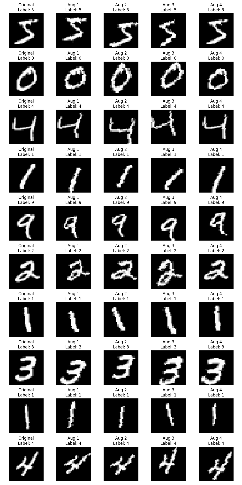

# MNIST Digit Classification with PyTorch

[](https://github.com/dhairyag/MINIST_CICD/actions/workflows/ml-pipeline.yml)

A lightweight Convolutional Neural Network (CNN) implementation for MNIST digit classification using PyTorch. 

The project includes a robust CI/CD pipeline implemented with GitHub Actions. All changes must pass the automated pipeline before deployment. For detailed metrics, see the [Actions tab](https://github.com/dhairyag/MINIST_CICD/actions).

## Project Overview

This project implements a simple CNN architecture to classify handwritten digits from the MNIST dataset. The model achieves >95% accuracy while maintaining a small parameter count (<25,000 parameters).

## Technical Architecture

### Model Architecture (SimpleCNN)
- Input: 28x28 grayscale images
- Architecture:
  - Conv1: 1 → 8 channels (3x3 kernel, padding=1)
  - BatchNorm + ReLU + MaxPool2d + Dropout(0.1)
  - Conv2: 8 → 16 channels (3x3 kernel, padding=1)
  - BatchNorm + ReLU + MaxPool2d + Dropout(0.1)
  - Fully Connected: 784 → 24 → 10
  - Output: 10 classes (digits 0-9)

### Key Features
- Automated ML pipeline using GitHub Actions
- Continuous integration with automated testing
- Model parameter efficiency (<25K parameters)
- Standardized data preprocessing
- CPU and GPU compatibility


## Requirements

- Python 3.8+
- PyTorch
- torchvision
- pytest
- tqdm

## Installation

### Clone the repository
```bash
git clone git@github.com:dhairyag/MINIST_CICD.git
cd MINIST_CICD
```

### Install dependencies
```bash
pip install -r requirements.txt
```


## Usage

### Training
```bash
python train.py
```
The trained model will be saved in the `models/` directory with a timestamp.

### Testing
```bash
python -m pytest tests/
```


## CI/CD Pipeline

The project includes a GitHub Actions workflow that:
1. Sets up Python 3.8
2. Installs dependencies
3. Trains the model
4. Runs the test suite

## Testing Suite

The project includes comprehensive testing to ensure model quality and reliability:

### Basic Model Tests
- Architecture verification
- Parameter count check (<25K parameters)
- Input/output shape validation
- Base accuracy validation (>95%)

### Advanced Model Validation
1. Confidence Testing
   - Validates prediction confidence scores
   - Ensures average confidence between 0.7 and 1.0
   - Helps detect uncertainty issues

2. Class Distribution Testing
   - Verifies balanced predictions across all digits
   - Ensures minimum 5% representation for each digit
   - Prevents class bias in predictions

3. Robustness Testing
   - Tests model stability with input noise
   - Adds Gaussian noise to test images
   - Ensures accuracy drop < 15% with noise
   - Validates basic adversarial robustness

### Running Tests
```bash
python -m pytest tests/
```

All tests must pass in the CI/CD pipeline before deployment.

## Model Performance

- Accuracy: >95% on MNIST test set
- Parameters: <25,000
- Training: Single epoch with Adam optimizer
- Learning Rate: 0.001
- Batch Size: 64
- Noise Robustness: <15% accuracy drop with Gaussian noise
- Prediction Confidence: >0.7 average confidence
- Class Balance: >5% representation for each digit

## Data Preprocessing

- Normalization: Mean=0.1307, Std=0.3081
- Input: 28x28 grayscale images
- Data augmentation:
  - Random rotation (±15 degrees)
  - Random translation (±10% in both directions)
  - Random scaling (90%-110%)
  - Random shearing (±10 degrees)
  - All augmentations are carefully chosen to preserve digit readability

### Augmentation Visualization

The training script automatically generates visualization of augmented samples in the `augmentation_samples/` directory. This helps in:
- Verifying the augmentation pipeline
- Ensuring augmentations preserve digit readability
- Documenting the types of variations introduced during training



Example augmentations showing original images (leftmost column) and 4 random augmentations per sample. The augmentations demonstrate how the transformations preserve digit readability while introducing natural variations.

